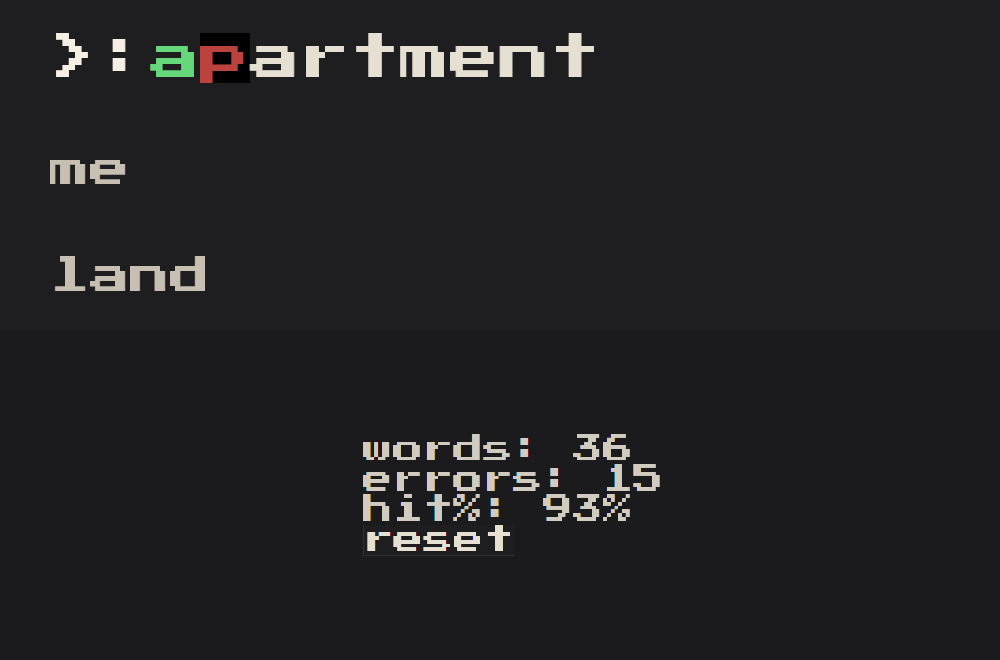

# hooked-on-typing

A React typing game built using React's new hooks API.

## How to Run Locally
```sh
git clone ...
cd hooked-on-typing
npm i
npm run dev
localhost:3000
```

## How to Play
Hit enter and type the letters that are highlighted. Metrics are captured, such as hit rate percentage, number of words completed, errors, etc. Click the reset button to start the game over.



## To Do
- Add timer to track speed/WPM
- Connect to dictionary API 
- Add different modes
  - Endless
  - Timed
  - Hardcore
- Word difficulty
- UI updates
- Optimized production build
